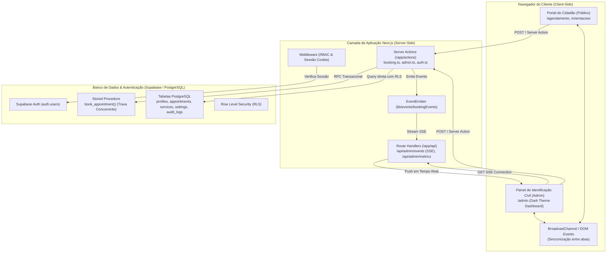
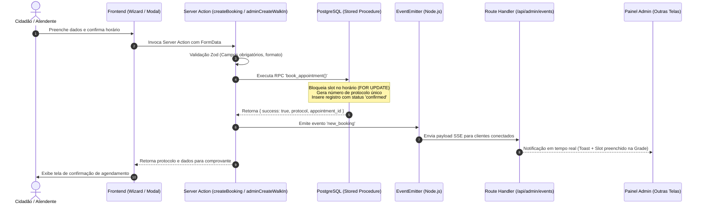
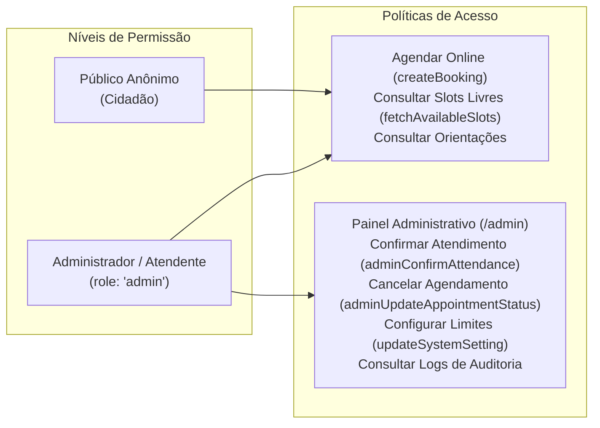

# Arquitetura do Sistema — Painel de Identificação Civil

> Documento técnico que detalha a arquitetura de software, padrões de projeto, topologia de rede, fluxos de dados e decisões de engenharia.

---

## 1. Visão Geral da Arquitetura

O sistema é construído sobre a arquitetura do **Next.js 16 (App Router)** utilizando o padrão híbrido de **React Server Components (RSC)**, **Server Actions**, **Route Handlers** e integração direta com banco de dados relacional **PostgreSQL (Supabase)**.

---

## 2. Padrão Arquitetural

A aplicação segue uma arquitetura em camadas orientada a domínio (Domain-Driven Layers) adaptada ao modelo Serverless/Edge do Next.js:

1. **Camada de Apresentação (Presentation Layer - `/components` & `/app`):**
   - **Server Components (RSC):** Renderizam a casca inicial, realizam queries iniciais no servidor e transmitem HTML otimizado com zero JavaScript adicional para elementos estáticos.
   - **Client Components (`'use client'`):** Responsáveis pela interatividade (ex.: `WeeklyCalendarGrid`, `BookingWizard`, `WalkInBookingModal`), gerenciando estado local, inputs e listeners de eventos.
2. **Camada de Ação e Negócio (Action / Domain Layer - `/app/actions` & `/services`):**
   - Funções assíncronas marcadas com `'use server'` que executam no servidor, validam entradas com **Zod**, aplicam regras de negócio, verificam contexto administrativo e geram logs de auditoria.
3. **Camada de Acesso a Dados e Persistência (Data Access Layer - `/lib/supabase` & `/supabase/migrations`):**
   - Comunicação com o PostgreSQL via `@supabase/ssr` e `@supabase/supabase-js`.
   - Stored Procedure `book_appointment` para atomicidade e isolamento ACID.
4. **Camada de Sincronização em Tempo Real (Real-Time Layer - `/lib/events` & `/app/api/admin/events`):**
   - Disparo reativo via `EventEmitter` centralizado que alimenta conexões de Server-Sent Events (SSE) sem necessidade de polling constante.

---

## 3. Fluxo de Dados Principal

### 3.1. Jornada de Criação de Agendamento (Online ou Presencial)

---

## 4. Decisões Técnicas e Racionais de Engenharia

### 4.1. Por que Next.js App Router e Server Actions?
- **Segurança de Dados:** Elimina a necessidade de expor credenciais de banco ou tokens sensíveis no cliente. Todas as operações de escrita passam por Server Actions executadas em ambiente seguro.
- **Redução de Bundle:** Componentes pesados de renderização de layout rodam no servidor.

### 4.2. Por que Stored Procedure (`book_appointment`) para Agendamentos?
- **Prevenção de Race Conditions:** Quando múltiplos cidadãos tentam agendar o mesmo horário no mesmo segundo, a validação no nível da aplicação em memória pode falhar. A Stored Procedure utiliza bloqueio em nível de linha no PostgreSQL, garantindo que apenas uma transação obtenha a vaga.

### 4.3. Por que Arquitetura Multi-Tier de Tempo Real (SSE + BroadcastChannel)?
- Em postos de atendimento físico, atendentes mantêm múltiplas abas abertas e múltiplos terminais conectados.
- **SSE:** Garante que agendamentos feitos pela internet entrem instantaneamente no painel dos atendentes.
- **BroadcastChannel:** Garante que alterações feitas em uma aba (ex.: cancelar um agendamento) reflitam instantaneamente nas outras abas do mesmo computador sem gerar tráfego de rede desnecessário.

---

## 5. Topologia e Segurança (RBAC & RLS)

- **Row Level Security (RLS):** Ativado em todas as tabelas no PostgreSQL.
- **Middleware Guard (`middleware.ts`):** Protege rotas `/admin/*` validando a existência do cookie de autenticação e a role `admin` no perfil do usuário.
