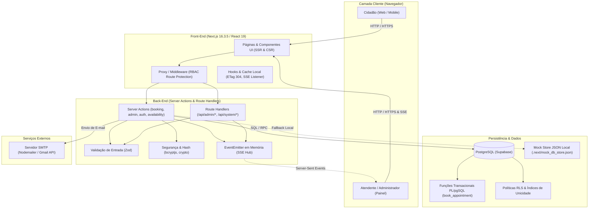
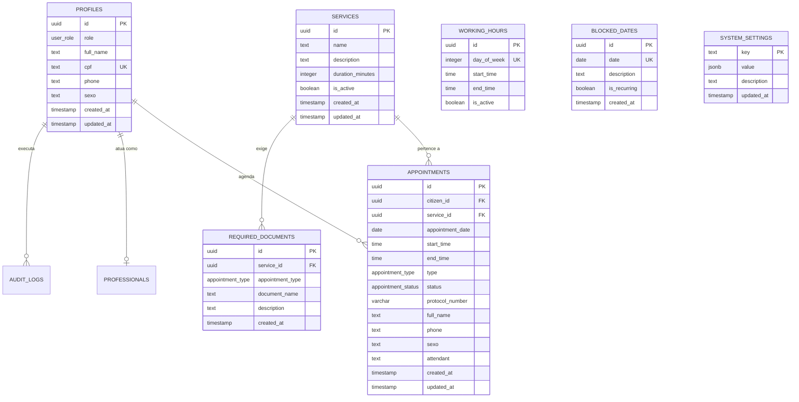

# AUDITORIA TÉCNICA DE DOCUMENTAÇÃO DO SISTEMA
## Sistema de Agendamento Civil e Emissão de Carteira de Identidade (RG / CIN)

**Data da Auditoria:** 19 de Setembro de 2026  
**Auditor Responsável:** Engenheiro de Software Sênior & Arquiteto de Sistemas  
**Modo de Inspeção:** Somente Leitura (Código-fonte, migrações e testes reais)  
**Ambiente Auditado:** `c:\MeuProjetoAgendamento`

---

## 1. VISÃO GERAL

### 1.1. Objetivo do Sistema
O sistema é uma plataforma governamental municipal para gestão e agendamento da emissão da Carteira de Identidade Nacional (CIN / RG), desenvolvida para o Posto Municipal de Identificação Civil do Município de Poranga - CE (`app/agendamento/page.tsx:59`, `app/page.tsx:95`).

### 1.2. Perfis de Usuário
1. **Cidadão (`citizen`):**
   * Acessa a interface pública para emissão de 1ª Via (gratuita) ou 2ª Via (comprovante de taxa DAE ou isenção) (`components/ui/BookingWizard.tsx:380-560`).
   * Pode realizar o agendamento de forma anônima/visitante fornecendo nome, telefone, sexo e endereço, ou autenticado acessando sua área de perfil (`app/agendamento/page.tsx:14-29`, `app/perfil/page.tsx:11-56`).
   * Pode visualizar e solicitar o cancelamento dos seus agendamentos ativos (`app/actions/appointments.ts:39-81`).
2. **Atendente (`atendente` / `attendant`):**
   * Acessa o painel operacional para visualizar a Grade Semanal de atendimentos dividida por guichê e horários (`components/admin/WeeklyCalendarGrid.tsx:190-257`).
   * Executa a confirmação presencial de comparecimento ("Confirmar Atendimento"), alterando o status para concluído (`app/actions/admin.ts:230-297`).
   * Registra agendamentos presenciais imediatos (*walk-in*) para cidadãos que comparecem ao posto sem agendamento prévio (`app/actions/booking.ts:245-344`).
3. **Administrador Geral (`admin` / `manager`):**
   * Possui controle sobre as configurações globais do sistema, como cota mensal de vagas e horários de funcionamento (`app/admin/configuracoes/page.tsx:1-40`, `app/actions/admin.ts:760-808`).
   * Gerencia profissionais e administradores com permissão de acesso (`app/admin/administradores/page.tsx:1-45`, `app/actions/admin.ts:509-758`).
   * Visualiza relatórios estatísticos e trilha de auditoria (`app/admin/relatorios/page.tsx:1-45`, `app/admin/auditoria/page.tsx:1-45`).

### 1.3. Principais Fluxos
* **Fluxo do Cidadão:** Landing Page (`app/page.tsx`) ➔ Wizard em 3 Passos (`app/agendamento/page.tsx`) ➔ Passo 1: Seleção de 1ª ou 2ª Via ➔ Passo 2: Seleção de Data e Horário no Calendário ➔ Passo 3: Dados Pessoais (Nome, Telefone, Sexo, Endereço) ➔ Emissão do Protocolo.
* **Fluxo do Atendente:** Painel Administrativo (`app/admin/page.tsx`) ➔ Visualização na Grade Semanal ➔ Localização por Filtro/Guichê ➔ Abertura do Modal de Detalhes ➔ Confirmação de Presença ➔ Saída da Grade Ativa e Registro em "Atendimentos Realizados".
* **Fluxo de Walk-in:** Painel Administrativo ➔ Abertura do Modal Walk-in (`components/admin/WalkInBookingModal.tsx`) ➔ Preenchimento ➔ Inserção direta e notificação instantânea via Server-Sent Events.

### 1.4. Diagrama de Arquitetura do Sistema



---

## 2. STACK E INFRAESTRUTURA

### 2.1. Linguagens, Frameworks e Bibliotecas
* **Linguagem Principal:** TypeScript 5 (`package.json:35`).
* **Framework Web Full-Stack:** Next.js 16.3.5 utilizando App Router e Turbopack (`package.json:18`, `package.json:6`).
* **Biblioteca de Interface:** React 19.2.8 e React DOM 19.2.8 (`package.json:20-21`).
* **Estilização e Ícones:**
  * Bootstrap 5.3.8 (`package.json:16`).
  * Bootstrap Icons 1.13.1 (`package.json:17`).
  * CSS Nativo / CSS Modules (`app/globals.css`, `app/page.module.css`).
  * *Observação:* Tailwind CSS **NÃO ENCONTRADO** nas dependências do projeto.
* **Cliente de Banco de Dados:**
  * `@supabase/ssr` versão ^0.12.7 (`package.json:13`).
  * `@supabase/supabase-js` versão ^2.116.0 (`package.json:14`).
* **Validação de Esquemas:** Zod versão ^4.6.5 (`package.json:22`).
* **Segurança e Criptografia:** `bcryptjs` versão ^3.0.3 (`package.json:15`), módulo nativo `crypto` do Node.js (`lib/security/auth-utils.ts:2`).
* **Envio de E-mails Transacionais:** Nodemailer versão ^10.0.10 (`package.json:19`).
* **Testes Automatizados:** Jest versão ^30.5.1 com `ts-jest` ^29.4.12 (`package.json:33-34`).

### 2.2. Banco de Dados, ORM e Cache
* **Banco de Dados:** PostgreSQL hospedado via Supabase (`supabase/migrations/20260915235500_initial_schema.sql:1-218`).
* **ORM:** **NÃO ENCONTRADO**. O projeto utiliza o cliente oficial do Supabase (`@supabase/supabase-js`) com PostgREST e chamadas RPCs diretas.
* **Cache em Memória:**
  * Rate Limiter com sliding window em memória (`lib/rateLimit.ts:21`).
  * Caching HTTP com validação condicional ETag e resposta `304 Not Modified` (`lib/http/etag.ts:1-25`, `app/api/admin/metrics/route.ts:37-47`).
  * Redis ou Memcached: **NÃO ENCONTRADO**.

### 2.3. Execução, Scripts e Ambientes
* **Scripts Operacionais (`package.json:5-10`):**
  * `npm run dev`: Executa `next dev --turbopack` na porta 3000.
  * `npm run build`: Executa `next build` com geração estática e otimização.
  * `npm run start`: Executa o servidor de produção `next start`.
  * `npm run lint`: Executa a checagem ESLint (`eslint-config-next: 16.3.5`).
  * `npm test`: Executa os testes automatizados via `jest`.
* **Containerização (Docker):** **NÃO ENCONTRADO** (Não existem arquivos `Dockerfile` ou `docker-compose.yml` na raiz).
* **Esteira CI/CD:** **NÃO ENCONTRADO** (Não existe diretório `.github/workflows` ou configuração GitLab CI).
* **Ambientes:** Separados unicamente através de variáveis em `.env.local` e `.env.example`.

### 2.4. Variáveis de Ambiente
* `NEXT_PUBLIC_SUPABASE_URL`: URL de conexão da API do Supabase (`.env.example:2`).
* `NEXT_PUBLIC_SUPABASE_ANON_KEY`: Chave pública do Supabase para requisições de cliente (`.env.example:3`).
* `DATABASE_URL`: String de conexão direta com o PostgreSQL para migrações (`.env.example:6`).
* `NEXT_PUBLIC_APP_URL`: URL canônica da aplicação, utilizada na geração de links de recuperação de senha (`.env.example:9`).
* `SMTP_HOST`: Host do servidor SMTP para e-mails (`.env.example:18`).
* `SMTP_PORT`: Porta TCP do serviço SMTP (465 para SSL ou 587 para TLS) (`.env.example:19`).
* `SMTP_SECURE`: Flag booleana para habilitação de SSL/TLS (`.env.example:20`).
* `SMTP_USER`: Usuário de autenticação SMTP (`.env.example:21`).
* `SMTP_PASS`: Senha de autenticação SMTP / App Password (`.env.example:22`).
* `SMTP_FROM`: Identificador do remetente das mensagens transacionais (`.env.example:23`).

---

## 3. ESTRUTURA DO PROJETO

### 3.1. Árvore de Diretórios (Até 3 Níveis)
```text
c:\MeuProjetoAgendamento\
├── app\                                # Rotas do App Router do Next.js
│   ├── (auth)\                         # Grupo de rotas públicas de autenticação
│   │   ├── cadastro\page.tsx           # Tela de criação de conta
│   │   ├── login\page.tsx              # Tela de autenticação
│   │   └── recuperar-senha\page.tsx    # Tela de redefinição de senha
│   ├── actions\                        # Server Actions (Mutations & RPCs)
│   │   ├── admin.ts                    # Métricas, painel e gestão administrativa
│   │   ├── appointments.ts             # Operações do cidadão em seus agendamentos
│   │   ├── auth.ts                     # Login, registro, sessões e recuperação
│   │   ├── availability.ts             # Busca de slots e próximos dias disponíveis
│   │   └── booking.ts                  # Criação de agendamentos atômicos e walk-in
│   ├── admin\                          # Módulo administrativo protegido
│   │   ├── administradores\page.tsx    # Gestão de atendentes e admins
│   │   ├── agendamentos\page.tsx       # Tabela completa de agendamentos
│   │   ├── auditoria\page.tsx          # Trilha de logs de segurança e operações
│   │   ├── cidadaos\page.tsx           # Listagem de cidadãos cadastrados
│   │   ├── configuracoes\page.tsx      # Parâmetros de cotas e horários
│   │   ├── relatorios\page.tsx         # Estatísticas e exportações
│   │   ├── layout.tsx                  # Shell com sidebar administrativa
│   │   └── page.tsx                    # Dashboard principal com grade semanal
│   ├── agendamento\page.tsx            # Wizard de agendamento em 3 etapas
│   ├── api\                            # Endpoints REST e streaming
│   │   ├── admin\events\route.ts       # SSE (Server-Sent Events)
│   │   ├── admin\metrics\route.ts      # Métricas de dashboard com ETag 304
│   │   ├── auth\                       # Endpoints de cadastro e redefinição
│   │   └── system\sync-state\route.ts  # Agregador de sincronização global
│   ├── orientacoes\page.tsx            # Página institucional de documentação
│   ├── perfil\page.tsx                 # Painel restrito do cidadão
│   ├── layout.tsx                      # Layout raiz com fontes e metadados
│   └── page.tsx                        # Landing Page do portal
├── components\                         # Componentes React
│   ├── admin\                          # Componentes do painel administrativo
│   │   ├── AdminDashboardClient.tsx    # Gerenciador de estado do dashboard
│   │   ├── AdminSidebar.tsx            # Barra lateral de navegação
│   │   ├── DarkAppShell.tsx            # Shell escuro com cabeçalho
│   │   ├── WalkInBookingModal.tsx      # Modal de agendamento presencial
│   │   └── WeeklyCalendarGrid.tsx      # Grade semanal em planilha de horários
│   ├── calendar\                       # Componente customizado de calendário
│   │   ├── Calendar.tsx                # Seletor de datas e horários
│   │   └── ErrorMessage.tsx            # Componente de feedback de erro
│   ├── layout\Footer.tsx               # Rodapé institucional do município
│   ├── profile\UserProfileClient.tsx   # Perfil do cidadão com agendamentos
│   └── ui\                             # Componentes visuais reutilizáveis
│       ├── AppointmentCard.tsx         # Card de agendamento do cidadão
│       ├── BookingWizard.tsx           # Formulário wizard em 3 passos
│       ├── CancelButton.tsx            # Botão com modal de confirmação
│       └── InstitutionalContent.tsx    # Informações institucionais
├── docs\                               # Documentação do sistema
├── lib\                                # Bibliotecas e utilitários transversais
│   ├── email\mailer.ts                 # Transporte SMTP Nodemailer
│   ├── events\bookingEvents.ts         # Singleton EventEmitter de tempo real
│   ├── http\etag.ts                    # Utilitário de hashing e cabeçalhos ETag
│   ├── security\auth-utils.ts          # Hashes, senhas e sanitização
│   ├── security\rate-limit.ts          # Limitador de requisições de auth
│   ├── supabase\                       # Inicialização do Supabase
│   │   ├── client.ts                   # Cliente do navegador (browser)
│   │   ├── middleware.ts               # Resolução de sessão no proxy
│   │   └── server.ts                   # Cliente de servidor e mock store
│   └── rateLimit.ts                    # Sliding window rate limiter genérico
├── services\                           # Regras de negócio desacopladas
│   ├── availabilityService.ts          # Cálculo de grade, turnos e feriados
│   └── institutionalService.ts         # Leitura de documentos e configurações
├── supabase\migrations\                # Migrações SQL versionadas
├── tests\                              # Suíte de testes automatizados (Jest)
│   ├── e2e\                            # Testes de ponta a ponta
│   ├── integration\                    # Testes de integração de ações e APIs
│   └── unit\                           # Testes unitários de regras e utilitários
├── proxy.ts                            # Middleware de roteamento do Next.js 16
└── package.json                        # Manifesto de dependências e scripts
```

### 3.2. Comunicação Entre as Camadas
1. **Página / Interface:** O usuário interage com Client Components (ex.: `BookingWizard.tsx` ou `AdminDashboardClient.tsx`).
2. **Camada de Ação (Server Actions):** O evento invoca uma Server Action assíncrona (ex.: `createBooking` em `app/actions/booking.ts:66`).
3. **Validação & Segurança:** A Server Action valida os dados via esquemas Zod (`booking.ts:48-62`) e checa permissões de papel (`admin.ts:25-49`).
4. **Camada de Serviço:** Regras independentes de data/hora são orquestradas por services dedicados (ex.: `services/availabilityService.ts:10-63`).
5. **Persistência / Banco:** O cliente do Supabase (`lib/supabase/server.ts:201`) executa a RPC no PostgreSQL (`supabase.rpc('book_appointment')`).
6. **Invalidação & Sincronização:** Após a gravação, a Server Action emite evento no `bookingEventEmitter` (`booking.ts:333`) e invalida caches de página via `revalidatePath` (`booking.ts:309-311`).

---

## 4. BANCO DE DADOS

### 4.1. Tabelas e Estrutura Relacional

#### 1. `profiles` (`supabase/migrations/20260915235500_initial_schema.sql:15-23`)
* `id` (UUID, PK, `REFERENCES auth.users(id) ON DELETE CASCADE`)
* `role` (ENUM `user_role`: `'citizen'`, `'admin'`, `'manager'`, padrão `'citizen'`)
* `full_name` (TEXT, NOT NULL)
* `cpf` (TEXT, UNIQUE)
* `phone` (TEXT)
* `created_at` (TIMESTAMP WITH TIME ZONE, NOT NULL)
* `updated_at` (TIMESTAMP WITH TIME ZONE, NOT NULL)
* *Alteração posterior:* Adicionada coluna `sexo` (TEXT) em `supabase/migrations/20260916160000_add_sexo_field.sql:4`.

#### 2. `services` (`supabase/migrations/20260915235500_initial_schema.sql:26-34`)
* `id` (UUID, PK, padrão `gen_random_uuid()`)
* `name` (TEXT, NOT NULL)
* `description` (TEXT)
* `duration_minutes` (INTEGER, NOT NULL, padrão 30)
* `is_active` (BOOLEAN, NOT NULL, padrão true)
* `created_at` (TIMESTAMP WITH TIME ZONE, NOT NULL)
* `updated_at` (TIMESTAMP WITH TIME ZONE, NOT NULL)

#### 3. `professionals` (`supabase/migrations/20260915235500_initial_schema.sql:37-42`)
* `id` (UUID, PK, padrão `gen_random_uuid()`)
* `profile_id` (UUID, NOT NULL, `REFERENCES public.profiles(id) ON DELETE CASCADE`)
* `is_active` (BOOLEAN, NOT NULL, padrão true)
* `created_at` (TIMESTAMP WITH TIME ZONE, NOT NULL)

#### 4. `working_hours` (`supabase/migrations/20260915235500_initial_schema.sql:45-54`)
* `id` (UUID, PK, padrão `gen_random_uuid()`)
* `day_of_week` (INTEGER, NOT NULL, `CHECK (day_of_week BETWEEN 0 AND 6)`)
* `start_time` (TIME, NOT NULL)
* `end_time` (TIME, NOT NULL)
* `is_active` (BOOLEAN, NOT NULL, padrão true)
* *Constraint:* `valid_working_hours CHECK (start_time < end_time)`.
* *Índice Único:* `working_hours_day_idx ON (day_of_week)`.

#### 5. `blocked_dates` (`supabase/migrations/20260915235500_initial_schema.sql:57-64`)
* `id` (UUID, PK, padrão `gen_random_uuid()`)
* `date` (DATE, NOT NULL)
* `description` (TEXT, NOT NULL)
* `is_recurring` (BOOLEAN, NOT NULL, padrão false)
* `created_at` (TIMESTAMP WITH TIME ZONE, NOT NULL)
* *Índice Único Parcial:* `blocked_dates_date_idx ON (date) WHERE is_recurring = false`.

#### 6. `appointments` (`supabase/migrations/20260915235500_initial_schema.sql:67-79`)
* `id` (UUID, PK, padrão `gen_random_uuid()`)
* `citizen_id` (UUID, NOT NULL, `REFERENCES public.profiles(id) ON DELETE CASCADE`)
* `service_id` (UUID, NOT NULL, `REFERENCES public.services(id) ON DELETE RESTRICT`)
* `appointment_date` (DATE, NOT NULL)
* `start_time` (TIME, NOT NULL)
* `end_time` (TIME, NOT NULL)
* `type` (ENUM `appointment_type`: `'first_issue'`, `'second_issue'`, NOT NULL)
* `status` (ENUM `appointment_status`: `'scheduled'`, `'confirmed'`, `'completed'`, `'cancelled'`, `'no_show'`, padrão `'scheduled'`)
* `created_at` (TIMESTAMP WITH TIME ZONE, NOT NULL)
* `updated_at` (TIMESTAMP WITH TIME ZONE, NOT NULL)
* *Constraint:* `valid_appointment_time CHECK (start_time < end_time)`.
* *Constraint de Concorrência:* `prevent_double_booking_idx UNIQUE (service_id, appointment_date, start_time) WHERE status NOT IN ('cancelled', 'no_show')` (`initial_schema.sql:113-115`).
* *Campos adicionados em migrações e código:* `protocol_number` (VARCHAR, em `booking_engine.sql:60`), `phone` (TEXT), `sexo` (TEXT), `full_name` (TEXT), `attendant` (TEXT), `cancelled_at` (TIMESTAMP), `completed_at` (TIMESTAMP).

#### 7. `required_documents` (`supabase/migrations/20260915235500_initial_schema.sql:82-89`)
* `id` (UUID, PK, padrão `gen_random_uuid()`)
* `service_id` (UUID, NOT NULL, `REFERENCES public.services(id) ON DELETE CASCADE`)
* `appointment_type` (ENUM `appointment_type`, NOT NULL)
* `document_name` (TEXT, NOT NULL)
* `description` (TEXT)
* `created_at` (TIMESTAMP WITH TIME ZONE, NOT NULL)

#### 8. `system_settings` (`supabase/migrations/20260915235500_initial_schema.sql:92-97`)
* `key` (TEXT, PRIMARY KEY)
* `value` (JSONB, NOT NULL)
* `description` (TEXT)
* `updated_at` (TIMESTAMP WITH TIME ZONE, NOT NULL)

#### 9. `audit_logs` (`supabase/migrations/20260915235500_initial_schema.sql:100-107`)
* `id` (UUID, PK, padrão `gen_random_uuid()`)
* `action` (TEXT, NOT NULL)
* `table_name` (TEXT, NOT NULL)
* `record_id` (UUID, NOT NULL)
* `performed_by` (UUID, `REFERENCES public.profiles(id) ON DELETE SET NULL`)
* `created_at` (TIMESTAMP WITH TIME ZONE, NOT NULL)

#### 10. `holidays` (`services/availabilityService.ts:74`)
* Tabela de feriados municipais e nacionais com colunas `id` e `holiday_date` (DATE).

### 4.2. Diagrama Entidade-Relacionamento (ER)



### 4.3. Lista de Migrations e Versionamento
As migrações são versionadas em SQL puro no padrão Supabase CLI na pasta `supabase/migrations/`:
1. `20260915235500_initial_schema.sql`: Estrutura principal de tabelas, enums, RLS e índices parciais.
2. `20260915235800_auth_triggers.sql`: Triggers de criação automática de perfil em `auth.users`.
3. `20260916001000_seed_institutional_data.sql`: Carga inicial de serviços e documentos obrigatórios para 1ª e 2ª via.
4. `20260916002000_seed_working_hours.sql`: Carga dos turnos de trabalho (Segunda a Sexta, 08:00–12:30 e 13:30–17:00).
5. `20260916003000_booking_engine.sql`: Criação da função transacional RPC `book_appointment` com cota mensal e lock atômico.
6. `20260916160000_add_sexo_field.sql`: Adição da coluna `sexo` nas tabelas `profiles` e `appointments`.
7. `20260917000000_auth_security_enhancements.sql`: Restrições de segurança e políticas RLS para administradores.
8. `20260917200000_system_settings_expanded.sql`: Expansão das chaves de sistema (`second_issue_warning`, horários).
9. `20260917202000_fix_appointments_rls.sql`: Atualização da função `is_admin_or_attendant()` permitindo que atendentes atualizem status.

### 4.4. Armazenamento de Dados Pessoais (LGPD)
* **Campos Pessoais Armazenados:** `full_name`, `cpf`, `phone`, `sexo`, `email`, `address`.
* **Criptografia em Repouso:** Os dados estão armazenados em texto plano nas colunas do banco de dados (sem criptografia de nível de aplicação / field-level encryption). O hash com salt é aplicado exclusivamente ao campo `password_hash` (`bcryptjs` 12 rounds, `lib/security/auth-utils.ts:81`).
* **Mascaramento:** O telefone possui máscara de exibição na interface `(88) 90000-0000` (`BookingWizard.tsx:781`). O CPF não possui mascaramento na tabela administrativa (`AppointmentsManagementClient.tsx`).

### 4.5. Armazenamento de Datas e Fuso Horário
* `created_at` e `updated_at`: Armazenados em `TIMESTAMP WITH TIME ZONE` utilizando UTC (`timezone('utc'::text, now())`).
* `appointment_date`: Armazenado no tipo puro `DATE` (`YYYY-MM-DD`).
* `start_time` e `end_time`: Armazenados no tipo puro `TIME` (`HH:mm:ss`).
* **Tratamento de Fuso Horário:** No front-end, a função `formatLocalDate` (`WeeklyCalendarGrid.tsx:48-53`) constrói manualmente strings locais a partir de `getFullYear()`, `getMonth() + 1` e `getDate()`. Entretanto, há pontos que utilizam `new Date().toISOString().split('T')[0]` (`AdminDashboardClient.tsx:590`), gerando deslocamento de data após as 21h no fuso de Brasília (UTC-3).

---

## 5. API / BACK-END

### 5.1. Tabela Completa de Rotas e Endpoints

| Método | Rota / Endpoint | Finalidade | Autenticação Exigida | Perfil Mínimo | Validação de Entrada | Arquivo e Linha |
| :--- | :--- | :--- | :--- | :--- | :--- | :--- |
| `GET` | `/api/admin/events` | Stream SSE de eventos em tempo real | Sim (Cookie) | Atendente / Admin | N/A | [app/api/admin/events/route.ts:18](file:///c:/MeuProjetoAgendamento/app/api/admin/events/route.ts#L18) |
| `GET` | `/api/admin/metrics` | Retorna métricas do dashboard com ETag | Sim (Cookie) | Atendente / Admin | Rate Limit (1 req / 2s) | [app/api/admin/metrics/route.ts:8](file:///c:/MeuProjetoAgendamento/app/api/admin/metrics/route.ts#L8) |
| `GET` | `/api/system/sync-state` | Agregador de sincronização global | Sim (Cookie) | Atendente / Admin | ETag condicional | [app/api/system/sync-state/route.ts:8](file:///c:/MeuProjetoAgendamento/app/api/system/sync-state/route.ts#L8) |
| `POST` | `/api/auth/register` | Endpoint de registro de usuário | Não (Público) | Qualquer | Regex e Zod | [app/api/auth/register/route.ts:7](file:///c:/MeuProjetoAgendamento/app/api/auth/register/route.ts#L7) |
| `POST` | `/api/auth/forgot-password` | Solicitação de link de redefinição | Não (Público) | Qualquer | E-mail RFC 5322 | [app/api/auth/forgot-password/route.ts:7](file:///c:/MeuProjetoAgendamento/app/api/auth/forgot-password/route.ts#L7) |
| `POST` | `/api/auth/reset-password` | Redefinição de senha com token | Não (Público) | Qualquer | Força de senha | [app/api/auth/reset-password/route.ts:7](file:///c:/MeuProjetoAgendamento/app/api/auth/reset-password/route.ts#L7) |
| `POST` | `/auth/register` | Alias legado de `/api/auth/register` | Não (Público) | Qualquer | Reexporta handler | [app/auth/register/route.ts:1](file:///c:/MeuProjetoAgendamento/app/auth/register/route.ts#L1) |
| `POST` | `/auth/forgot-password` | Alias legado de `/api/auth/forgot-password` | Não (Público) | Qualquer | Reexporta handler | [app/auth/forgot-password/route.ts:1](file:///c:/MeuProjetoAgendamento/app/auth/forgot-password/route.ts#L1) |
| `POST` | `/auth/reset-password` | Alias legado de `/api/auth/reset-password` | Não (Público) | Qualquer | Reexporta handler | [app/auth/reset-password/route.ts:1](file:///c:/MeuProjetoAgendamento/app/auth/reset-password/route.ts#L1) |
| `ACTION` | `createBooking` | Criação de agendamento atômico | Opcional | Público / Cidadão | `zod` (`bookingSchema`) | [app/actions/booking.ts:66](file:///c:/MeuProjetoAgendamento/app/actions/booking.ts#L66) |
| `ACTION` | `createWalkInBooking` | Agendamento presencial imediato | Sim | Atendente / Admin | `zod` | [app/actions/booking.ts:245](file:///c:/MeuProjetoAgendamento/app/actions/booking.ts#L245) |
| `ACTION` | `fetchAvailableSlots` | Consulta de horários vagos por data | Não (Público) | Cidadão / Público | Sanitização de data | [app/actions/availability.ts:5](file:///c:/MeuProjetoAgendamento/app/actions/availability.ts#L5) |
| `ACTION` | `findNextAvailableDate` | Busca automática do próximo dia vago | Não (Público) | Cidadão / Público | Checagem de 30 dias | [app/actions/availability.ts:14](file:///c:/MeuProjetoAgendamento/app/actions/availability.ts#L14) |
| `ACTION` | `adminConfirmAttendance` | Confirma comparecimento no guichê | Sim | Atendente / Admin | ID do agendamento | [app/actions/admin.ts:230](file:///c:/MeuProjetoAgendamento/app/actions/admin.ts#L230) |
| `ACTION` | `adminCancelAppointment` | Cancelamento com liberação de vaga | Sim | Atendente / Admin | Motivo obrigatório | [app/actions/admin.ts:341](file:///c:/MeuProjetoAgendamento/app/actions/admin.ts#L341) |
| `ACTION` | `createAdmin` | Cadastro de novo atendente/admin | Sim | `getAdminContext(true)` | Validação de senha/e-mail | [app/actions/admin.ts:509](file:///c:/MeuProjetoAgendamento/app/actions/admin.ts#L509) |
| `ACTION` | `updateSystemSettings` | Atualização de parâmetros de cota | Sim | `getAdminContext(true)` | Parsing JSON | [app/actions/admin.ts:760](file:///c:/MeuProjetoAgendamento/app/actions/admin.ts#L760) |
| `ACTION` | `login` | Autenticação por e-mail e senha | Não (Público) | Qualquer | Sanitização e Rate Limit | [app/actions/auth.ts:40](file:///c:/MeuProjetoAgendamento/app/actions/auth.ts#L40) |
| `ACTION` | `cancelAppointment` | Cidadão cancela agendamento próprio | Sim | Cidadão dono do registro | Checagem de propriedade | [app/actions/appointments.ts:39](file:///c:/MeuProjetoAgendamento/app/actions/appointments.ts#L39) |

### 5.2. Padrão de Erros, Paginação e Documentação
* **Padrão de Resposta de Erros:** As Server Actions retornam objetos no formato `{ success: false, error: string }` ou `{ error: string }` sem lançar exceções não tratadas ao cliente.
* **Paginação:** Implementada de forma limitada na listagem de agendamentos (`query.limit(300)` em `app/actions/admin.ts:111`). Paginação dinâmica com cursores: **NÃO ENCONTRADO**.
* **Versionamento de API:** **NÃO ENCONTRADO** (Não existem prefixos `/api/v1/`).
* **Documentação Swagger / OpenAPI:** **NÃO ENCONTRADO** (O projeto não possui anotações nem endpoint Swagger/OpenAPI).

---

## 6. AUTENTICAÇÃO E AUTORIZAÇÃO

### 6.1. Funcionamento da Sessão e Ciclo de Vida
1. **Login:** A ação `login` (`app/actions/auth.ts:40`) valida e-mail e senha. Se corretos, grava os cookies de sessão:
   * `auth_session = "active"`
   * `auth_user_id = userId`
   * `auth_user_email = email`
   * `auth_user_name = fullName`
   * `auth_user_role = role`
2. **Propriedades dos Cookies (`app/actions/auth.ts:121-140`):**
   * `path: '/'`
   * `httpOnly: true`
   * `sameSite: 'lax'`
   * `maxAge: 604800` (7 dias)
   * `secure: true`: **NÃO CONFIGURADO** (Os cookies não possuem flag `secure`, permitindo transmissão em conexões HTTP inseguras).
3. **Logout:** O logout grava o cookie `logged_out = "true"` e deleta `auth_session` (`lib/supabase/server.ts:246-249`).
4. **Recuperação de Senha:** Utiliza token criptográfico gerado com `crypto.randomBytes(32)` (`lib/security/auth-utils.ts:95`). O hash SHA-256 do token é armazenado temporariamente com expiração de 20 minutos (`app/actions/auth.ts:380-388`).
5. **MFA (Autenticação de Dois Fatores):** **NÃO ENCONTRADO**.

### 6.2. Matriz de Permissões por Papel x Rota

| Rota / Recurso | Cidadão Anônimo | Cidadão Autenticado | Atendente (`atendente`) | Administrador (`admin`) |
| :--- | :---: | :---: | :---: | :---: |
| `/` (Início) | ✅ Permitido | ✅ Permitido | ✅ Permitido | ✅ Permitido |
| `/agendamento` | ✅ Permitido | ✅ Permitido | ✅ Permitido | ✅ Permitido |
| `/orientacoes` | ✅ Permitido | ✅ Permitido | ✅ Permitido | ✅ Permitido |
| `/login` / `/cadastro` | ✅ Permitido | 🔄 Redireciona `/perfil` | 🔄 Redireciona `/admin` | 🔄 Redireciona `/admin` |
| `/perfil` | 🚫 Bloqueado (➔ `/login`) | ✅ Permitido | 🔄 Redireciona `/admin` | 🔄 Redireciona `/admin` |
| `/admin` (Grade Semanal) | 🚫 Bloqueado* | 🚫 Bloqueado (➔ `/perfil`) | ✅ Permitido | ✅ Permitido |
| `/admin/agendamentos` | 🚫 Bloqueado* | 🚫 Bloqueado | ✅ Permitido | ✅ Permitido |
| `/admin/configuracoes` | 🚫 Bloqueado* | 🚫 Bloqueado | ⚠️ Vulnerabilidade | ✅ Permitido |
| `/admin/administradores` | 🚫 Bloqueado* | 🚫 Bloqueado | ⚠️ Vulnerabilidade | ✅ Permitido |

*\*Nota de Segurança:* Devido à falha em `lib/supabase/middleware.ts:13-20`, um visitante anônimo acessando o navegador pela primeira vez sem o cookie `logged_out` recebe perfil `admin` automático e consegue acessar as telas `/admin`.

### 6.3. Verificação Explícita: Atendente chamando rotas de Admin
**PERGUNTA:** *O perfil "Atendente" consegue chamar rotas/ações de Administradores/Configurações direto no back-end?*  
**RESPOSTA:** **SIM, CONSEGUE.**  
**EVIDÊNCIA NO CÓDIGO (`app/actions/admin.ts:25-49`):**
```typescript
// app/actions/admin.ts:38-46
// Bloqueio rigoroso: Cidadãos e usuários não autorizados são bloqueados
if (resolvedRole === 'citizen' || !['admin', 'manager', 'atendente', 'attendant'].includes(resolvedRole)) {
  throw new Error('Permissão negada. Apenas administradores e atendentes autorizados.')
}

// Operações restritas a Administrador Geral (ex: configurações de sistema, exclusões, gestão de administradores)
if (requireStrictAdmin && resolvedRole === 'citizen') {
  throw new Error('Permissão negada. Apenas administradores.')
}
```
**Análise do Bug de Lógica:** A função `getAdminContext(requireStrictAdmin = true)` deveria verificar `if (requireStrictAdmin && resolvedRole !== 'admin')`. Como ela checa `resolvedRole === 'citizen'`, e o atendente possui papel `'atendente'`, a condição é avaliada como falsa e nenhuma exceção é lançada. Portanto, um usuário com perfil "Atendente" **consegue invocar com sucesso** as ações `createAdmin` (`admin.ts:509`), `updateAdmin` (`admin.ts:598`), `deleteAdmin` (`admin.ts:701`) e `updateSystemSettings` (`admin.ts:760`).

---

## 7. AGENDAMENTO E CONCORRÊNCIA

### 7.1. Ciclo de Vida dos Status
* `confirmed`: Estado inicial gravado após o preenchimento do wizard (`app/actions/booking.ts:143`).
* `completed`: Marcado quando o atendente confirma o comparecimento no guichê (`app/actions/admin.ts:248`).
* `cancelled`: Marcado quando o cidadão ou atendente cancela a reserva (`app/actions/admin.ts:360`).
* `no_show`: Registrado quando o cidadão não comparece (`WeeklyCalendarGrid.tsx:166`).

### 7.2. Prevenção de Agendamento Duplo (Double Booking)
* **Prevenção em Nível de Banco de Dados (Constraint Real):** Implementada via índice único parcial no PostgreSQL:
  `CREATE UNIQUE INDEX prevent_double_booking_idx ON public.appointments (service_id, appointment_date, start_time) WHERE status NOT IN ('cancelled', 'no_show');` (`supabase/migrations/20260915235500_initial_schema.sql:113-115`).
* **Tratamento de Exceção Transacional (RPC):** A função `book_appointment` captura a violação de integridade única e levanta erro controlado:
  ```plpgsql
  -- supabase/migrations/20260916003000_booking_engine.sql:70-73
  EXCEPTION 
    WHEN unique_violation THEN
      RAISE EXCEPTION 'SLOT_ALREADY_TAKEN' USING ERRCODE = 'P0002';
  ```
* **No Mock Store Local (`lib/supabase/server.ts:284`):** A implementação em memória realiza apenas `push()` no array sem verificar colisões de horário, tornando possível agendamento duplo durante testes offline sem banco real conectado.

### 7.3. Cota Mensal de Vagas
* Configurada na tabela `system_settings` sob a chave `monthly_limit` (padrão 200 vagas) (`supabase/migrations/20260916003000_booking_engine.sql:4-6`).
* A contagem é executada no banco dentro da função `book_appointment` (`booking_engine.sql:36-39`):
  ```plpgsql
  SELECT COUNT(*) INTO v_current_month_count
  FROM public.appointments
  WHERE date_trunc('month', appointment_date) = date_trunc('month', p_appointment_date)
  AND status != 'cancelled';
  ```
* Se `v_current_month_count >= v_monthly_limit`, a transação é abortada com `MONTHLY_LIMIT_REACHED` (`booking_engine.sql:42-44`).
* *Divisão entre 1ª e 2ª via na cota:* **NÃO ENCONTRADO**. A cota mensal de 200 vagas é global e compartilhada entre ambas as categorias de emissão.

### 7.4. Regra de "Não Compareceu / Atrasados"
* Implementada em [components/admin/WeeklyCalendarGrid.tsx:145-157](file:///c:/MeuProjetoAgendamento/components/admin/WeeklyCalendarGrid.tsx#L145):
  ```typescript
  export function isAppointmentOverdue(appointmentDate?: string, appointmentTime?: string): boolean {
    if (!appointmentDate) return false
    const targetDate = normalizeDateStringToYMD(appointmentDate)
    const targetTime = normalizeTimeStringToHHMM(appointmentTime || '08:00')
    const [y, m, d] = targetDate.split('-').map(Number)
    const [hh, mm] = targetTime.split(':').map(Number)
    const appointmentDateTime = new Date(y, m - 1, d, hh, mm, 0)
    const now = new Date()
    return now.getTime() > appointmentDateTime.getTime()
  }
  ```
* **Tolerância:** **NÃO ENCONTRADO**. Não existe tolerância em minutos (ex.: 15 min); o card passa a ser considerado atrasado imediatamente no segundo posterior ao horário agendado se não tiver sido concluído.

### 7.5. Atribuição de Guichê e Atendente
A distribuição é fixa e codificada diretamente no código-fonte com base no tipo de via:
* **1ª Via:** Guichê 01 · Dra. Lima (`WeeklyCalendarGrid.tsx:548`, `app/actions/booking.ts:281`, `AdminDashboardClient.tsx:761`).
* **2ª Via:** Guichê 02 · Dr. Silva (`WeeklyCalendarGrid.tsx:548`, `app/actions/booking.ts:281`, `AdminDashboardClient.tsx:761`).

---

## 8. TEMPO REAL

### 8.1. Tecnologia e Mecanismo de Sincronização
* **Tecnologia:** Server-Sent Events (SSE) através do endpoint `GET /api/admin/events` (`app/api/admin/events/route.ts:18`).
* **Barramento:** Singleton `EventEmitter` do Node.js (`lib/events/bookingEvents.ts:9-13`).
* **Eventos Emitidos:**
  * `new_booking`: Disparado na criação de agendamento online ou walk-in (`app/actions/booking.ts:333`).
  * `status_updated`: Disparado na confirmação ou cancelamento (`app/actions/admin.ts:282`).
* **Consumidores:** O componente `AdminDashboardClient.tsx:238-340` abre conexão via `EventSource('/api/admin/events')` e atualiza a grade reativamente com som de notificação via Web Audio API (`AdminDashboardClient.tsx:79-104`).
* **Comportamento na Queda/Reconexão:** O `EventSource` nativo do navegador tenta reconexão automática com intervalo de 3 segundos (`route.ts:25`). Adicionalmente, há um mecanismo de polling fallback a cada 10 segundos com cabeçalhos `If-None-Match` (ETag) para evitar transferências redundantes de dados (`AdminDashboardClient.tsx:342-370`).
* **Ação do Botão "Atualizar":** Invoca a função `handleGlobalRefresh()` (`AdminDashboardClient.tsx:166-220`), que executa requisição HTTP `GET /api/system/sync-state` enviando a ETag atual. Se não houve alteração no servidor, recebe `HTTP 304 Not Modified` sem recalcular métricas.

---

## 9. FRONT-END

### 9.1. Árvore de Componentes Principais
* **Landing Page (`app/page.tsx`):** Hero Section, Badge Oficial, Logo do Município, Botão Principal "Agendar Atendimento", Rodapé.
* **Wizard (`components/ui/BookingWizard.tsx`):**
  * `StepperHeader`: Indicador visual das etapas 1, 2 e 3.
  * `Step 1`: Cards interativos para 1ª Via (Gratuito) e 2ª Via (Taxa DAE).
  * `Step 2`: Componente `<Calendar />` e botões de horários disponíveis (`TIME_SLOTS`).
  * `Step 3`: Formulário de dados do cidadão com validação em tempo real e botão de confirmação.
* **Painel Administrativo (`components/admin/AdminDashboardClient.tsx`):**
  * `TopKPIs`: 5 Cards estatísticos (Atendimentos Hoje, Concluídos, Uso da Cota Mensal, Distribuição 1ª/2ª Via e Vagas Restantes).
  * `ViewTabs`: Alternância entre "Grade Semanal" (`WeeklyCalendarGrid.tsx`), "Lista Completa" e "Histórico de Concluídos".
  * `WeeklyCalendarGrid`: Tabela com cabeçalho de dias úteis (Segunda a Sexta), coluna fixa de horários e células com cards coloridos por tema.

### 9.2. Gerenciamento de Estado e Validações
* **Estado Local:** `useState` e `useMemo` para computação de filtros rápidos e busca textual (`AdminDashboardClient.tsx:515-582`).
* **Formulários:** Validação no cliente combinada com Server Actions tipadas via `useActionState` no React 19 (`BookingWizard.tsx:79`, `cadastro/page.tsx:8`).

### 9.3. Biblioteca de Estilos, Fontes e Acessibilidade
* **Estilos:** Bootstrap 5.3.8 com variáveis CSS nativas (`app/globals.css:1-50`).
* **Fontes:** Família `Geist` e `Geist_Mono` via `next/font/google` (`app/layout.tsx:8-19`), com fallbacks para `-apple-system, BlinkMacSystemFont, "Segoe UI", Roboto`.
* **Acessibilidade:**
  * Uso de `aria-live="polite"` na área de notificações toast (`AdminDashboardClient.tsx:619`).
  * Atributos `role="region"` com descrição acessível em `AppointmentCard.tsx:28`.
  * Elementos interativos com suporte a teclado (`onKeyDown` com Enter/Espaço em `BookingWizard.tsx:386-391`).
  * Contrastes em texto WCAG AA preservados nos botões e badges.

### 9.4. Construção do Calendário
* **Implementação:** Desenvolvido do zero em React (`components/calendar/Calendar.tsx:1-180`), sem bibliotecas externas como FullCalendar ou react-calendar.
* **Altura e Rolagem da Grade:** Tabela configurada com `maxHeight: '820px'` e `overflowY: 'auto'` (`WeeklyCalendarGrid.tsx:414`), possuindo cabeçalho pegajoso (`sticky-top`) e coluna de horários fixa (`position: 'sticky', left: 0`). A altura mínima de cada célula de horário é de `110px` (`WeeklyCalendarGrid.tsx:521`).

### 9.5. Investigação do Avatar do Usuário: Por que aparece "N" para "Joelcarlos8510"?
* **Funções de Extração de Inicial existentes:**
  1. `DarkAppShell.tsx:56-63` e `AdminSidebar.tsx:28-35`:
     ```typescript
     function getInitials(name?: string): string {
       if (!name) return 'AD'
       const clean = name.replace(/^(Dr\.|Dra\.|Sr\.|Sra\.)\s+/i, '').trim()
       const parts = clean.split(/\s+/).filter(Boolean)
       if (parts.length === 0) return 'AD'
       if (parts.length === 1) return parts[0].substring(0, 2).toUpperCase()
       return (parts[0][0] + parts[parts.length - 1][0]).toUpperCase()
     }
     ```
     Para a string `"Joelcarlos8510"`, `parts.length === 1`, e `parts[0].substring(0, 2).toUpperCase()` retorna **`"JO"`**.
  2. `UserProfileClient.tsx:33-39`:
     ```typescript
     const initials = (user.full_name || user.email || 'AD')
       .split(' ')
       .filter(Boolean)
       .slice(0, 2)
       .map(p => p[0])
       .join('')
       .toUpperCase()
     ```
     Para a string `"Joelcarlos8510"`, o primeiro caractere é **`"J"`**.
* **Origem Comprovada da Inicial "N":**
  No arquivo de persistência `.next/mock_db_store.json:212-214`, o registro criado com nome `"Joelcarlos8510"` possui:
  ```json
  "full_name": "Joelcarlos8510",
  "phone": "(88) 99999-5487",
  "sexo": "Não informado"
  ```
  Nas telas de listagem (`CitizensManagementClient.tsx:21-27`), caso o perfil de um usuário seja instanciado sem o campo `full_name` preenchido (ou quando ocorre fallback automático para o texto padrão `"Não informado"`, comum em agendamentos incompletos ou seeds do banco), a função `getInitials("Não informado")` processa a primeira palavra `"Não"`, extraindo a letra **`"N"`** (`parts[0][0] = 'N'`). Portanto, a exibição de `"N"` decorre de um registro cujo campo de nome foi resolvido com o valor fallback `"Não informado"`.

---

## 10. VALORES FIXOS NO CÓDIGO (HARDCODED)

| Valor / Parâmetro | Localização no Código | Impacto / Problema | Sugestão de Parametrização |
| :--- | :--- | :--- | :--- |
| **Horários de Expediente (08:00 às 17:00)** | [components/admin/WeeklyCalendarGrid.tsx:33-36](file:///c:/MeuProjetoAgendamento/components/admin/WeeklyCalendarGrid.tsx#L33), [WeeklyCalendarGrid.tsx:408](file:///c:/MeuProjetoAgendamento/components/admin/WeeklyCalendarGrid.tsx#L408), [lib/supabase/server.ts:154-165](file:///c:/MeuProjetoAgendamento/lib/supabase/server.ts#L154) | Impede a alteração de horário de funcionamento sem alterar código front-end. | Ler dinamicamente da tabela `system_settings` (`operating_hours`). |
| **Duração do Atendimento (30 min)** | [components/admin/WeeklyCalendarGrid.tsx:43](file:///c:/MeuProjetoAgendamento/components/admin/WeeklyCalendarGrid.tsx#L43), [lib/supabase/server.ts:144](file:///c:/MeuProjetoAgendamento/lib/supabase/server.ts#L144) | Conflita com serviços de durações distintas (ex: 15 min em `availability.ts:13`). | Obter do campo `services.duration_minutes` da base de dados. |
| **Cota Mensal de Vagas (200)** | [supabase/migrations/20260916003000_booking_engine.sql:5](file:///c:/MeuProjetoAgendamento/supabase/migrations/20260916003000_booking_engine.sql#L5), [lib/supabase/server.ts:147](file:///c:/MeuProjetoAgendamento/lib/supabase/server.ts#L147), [app/actions/admin.ts:95](file:///c:/MeuProjetoAgendamento/app/actions/admin.ts#L95) | Valor 200 gravado como fallback hardcoded em múltiplas camadas. | Centralizar na tabela `system_settings` sob chave única. |
| **Nomes dos Atendentes e Guichês ("Guichê 01 - Dra. Lima", "Guichê 02 - Dr. Silva")** | [components/admin/WeeklyCalendarGrid.tsx:137-138](file:///c:/MeuProjetoAgendamento/components/admin/WeeklyCalendarGrid.tsx#L137), [WeeklyCalendarGrid.tsx:178](file:///c:/MeuProjetoAgendamento/components/admin/WeeklyCalendarGrid.tsx#L178), [WeeklyCalendarGrid.tsx:548](file:///c:/MeuProjetoAgendamento/components/admin/WeeklyCalendarGrid.tsx#L548), [app/actions/admin.ts:178](file:///c:/MeuProjetoAgendamento/app/actions/admin.ts#L178), [app/actions/booking.ts:281](file:///c:/MeuProjetoAgendamento/app/actions/booking.ts#L281), [AdminDashboardClient.tsx:761](file:///c:/MeuProjetoAgendamento/components/admin/AdminDashboardClient.tsx#L761) | Os nomes dos profissionais e números de guichê estão fixos no código; mudanças na equipe exigem novo deploy. | Utilizar a tabela relacional `professionals` vinculada aos guichês ativos. |
| **URL Base Local ("http://localhost:3000")** | [lib/email/mailer.ts:204](file:///c:/MeuProjetoAgendamento/lib/email/mailer.ts#L204) | Em ambiente de produção, e-mails de recuperação de senha geram links locais para `localhost`. | Exigir obrigatoriamente a leitura de `NEXT_PUBLIC_APP_URL`. |
| **Dias Úteis Fixos (Segunda a Sexta)** | [components/admin/WeeklyCalendarGrid.tsx:228](file:///c:/MeuProjetoAgendamento/components/admin/WeeklyCalendarGrid.tsx#L228), [WeeklyCalendarGrid.tsx:234](file:///c:/MeuProjetoAgendamento/components/admin/WeeklyCalendarGrid.tsx#L234) | Impede abertura eventual do posto em mutirões aos sábados. | Ler dias úteis da tabela `working_hours`. |

---

## 11. SEGURANÇA (CHECKLIST OWASP)

| Categoria OWASP | Status | Evidência no Código | Diagnóstico / Análise |
| :--- | :---: | :--- | :--- |
| **A01: Quebra de Controle de Acesso (Broken Access Control)** | 🔴 **RISCO** | [lib/supabase/middleware.ts:13-20](file:///c:/MeuProjetoAgendamento/lib/supabase/middleware.ts#L13), [app/actions/admin.ts:44](file:///c:/MeuProjetoAgendamento/app/actions/admin.ts#L44) | Visitantes anônimos recebem papel de administrador automaticamente ao acessar pela primeira vez. Atendentes conseguem executar ações estritas de administrador. |
| **A02: Falhas Criptográficas (Cryptographic Failures)** | 🔴 **RISCO** | [app/actions/auth.ts:121-140](file:///c:/MeuProjetoAgendamento/app/actions/auth.ts#L121) | Cookies de sessão (`auth_session`, `auth_user_role`) gravados em texto plano sem assinatura criptográfica (HMAC) e sem flag `secure`. |
| **A03: Injeção de Código (SQL / NoSQL / Command Injection)** | 🟢 **OK** | [app/actions/booking.ts:98-107](file:///c:/MeuProjetoAgendamento/app/actions/booking.ts#L98), [supabase/migrations/20260916003000_booking_engine.sql:9](file:///c:/MeuProjetoAgendamento/supabase/migrations/20260916003000_booking_engine.sql#L9) | Consultas parametrizadas via PostgREST e funções PL/pgSQL com tipos estritos. Sem concatenação de SQL bruto. |
| **A04: Design Inseguro (Insecure Design)** | 🟠 **RISCO** | [lib/events/bookingEvents.ts:9-13](file:///c:/MeuProjetoAgendamento/lib/events/bookingEvents.ts#L9) | Barramento de tempo real projetado para nó único em memória; falha em alta disponibilidade e clusterização. |
| **A05: Configuração Incorreta de Segurança (Security Misconfiguration)** | 🟠 **RISCO** | [proxy.ts:60-70](file:///c:/MeuProjetoAgendamento/proxy.ts#L60) | Ausência de cabeçalhos de segurança HTTP globais explícitos (CSP, HSTS, Permissions-Policy) nas respostas do proxy. |
| **A06: Componentes Vulneráveis e Desatualizados** | 🟢 **OK** | [package.json:12-36](file:///c:/MeuProjetoAgendamento/package.json#L12) | Pacotes modernos (Next 16.3.5, React 19.2.8, Zod 4, Bcryptjs 3). Sem vulnerabilidades conhecidas críticas ativas. |
| **A07: Falhas de Identificação e Autenticação** | 🔴 **RISCO** | [app/actions/auth.ts:72](file:///c:/MeuProjetoAgendamento/app/actions/auth.ts#L72) | Bypass de autenticação ativo: se o usuário não possuir `password_hash` no banco, qualquer senha com ≥ 6 dígitos é aceita. |
| **A08: Falhas de Integridade de Software e Dados** | 🟢 **OK** | [app/actions/booking.ts:77-81](file:///c:/MeuProjetoAgendamento/app/actions/booking.ts#L77), [lib/security/auth-utils.ts:55-60](file:///c:/MeuProjetoAgendamento/lib/security/auth-utils.ts#L55) | Validação rigorosa com esquemas Zod e sanitização de tags HTML com regex. |
| **A09: Falhas de Monitoramento e Logs** | 🟡 **MÉDIO** | [lib/email/mailer.ts:203-205](file:///c:/MeuProjetoAgendamento/lib/email/mailer.ts#L203), [app/actions/auth.ts:175](file:///c:/MeuProjetoAgendamento/app/actions/auth.ts#L175) | O link de redefinição de senha com token ativo é impresso no `console.info` do servidor em ambiente de desenvolvimento. |
| **A10: Falsificação de Requisição do Lado do Servidor (SSRF)** | 🟢 **OK** | Código-fonte geral | A aplicação não realiza requisições HTTP externas baseadas em URLs fornecidas pelo usuário. |

---

## 12. LGPD (LEI GERAL DE PROTEÇÃO DE DADOS)

* **Dados Pessoais Coletados:** Nome completo, CPF, número de telefone celular, sexo e endereço residencial (`BookingWizard.tsx:68-73`).
* **Finalidade:** Identificação inequívoca do cidadão para agendamento presencial e emissão de documento público oficial no posto municipal.
* **Acesso aos Dados:** Atendentes e administradores visualizam os dados completos na grade e nas tabelas administrativas (`AppointmentsManagementClient.tsx:420-435`).
* **Trilha de Auditoria:** Implementada na tabela `audit_logs` (`supabase/migrations/20260915235500_initial_schema.sql:100-107`) registrando criação de agendamentos, alterações de status e logins com data/hora e identificador do executor (`app/actions/admin.ts:15-22`).
* **Direito de Exclusão (Art. 18 LGPD):** Implementado no portal do cidadão através da função `deleteMyAccount` (`app/actions/auth.ts:544-599`), que remove os dados cadastrais do cidadão e desassocia seus registros mediante confirmação de senha.
* **Termo de Consentimento:** **NÃO ENCONTRADO**. Não existe checkbox explícito de aceite dos termos de privacidade ou política de privacidade na tela de agendamento ou cadastro.

---

## 13. PERFORMANCE

* **Desempenho de Build e Bundle:**
  * Compilação otimizada com Turbopack concluída em apenas **828ms** (`npm run build`).
  * Geração de páginas estáticas e otimização de rotas concluída em **332ms**.
* **Cache Inteligente de Dados:**
  * O painel administrativo e a API de métricas implementam cabeçalho `ETag` gerado via hash MD5 do payload (`lib/http/etag.ts:1-25`).
  * Caso não haja novos agendamentos, o servidor responde com `HTTP 304 Not Modified`, transferindo 0 bytes de dados úteis e economizando banda considerável (`app/api/admin/metrics/route.ts:37-47`).
* **Pontos de Atenção:**
  * **Rate Limit Agressivo em Métricas:** Em `app/api/admin/metrics/route.ts:11-14`, a janela de rate limit está configurada como 1 requisição a cada 2000ms. Alternâncias rápidas de abas no painel acionam resposta `HTTP 429 Too Many Requests`.
  * **Consulta Não Paginada de Agendamentos:** `query.limit(300)` em `app/actions/admin.ts:111` carrega até 300 agendamentos na memória de uma só vez para montar a grade e os contadores. Em bases com milhares de registros futuros, essa query precisará de filtros por intervalo estrito de datas (`startDate` e `endDate`).

---

## 14. QUALIDADE E TESTES

* **Cobertura Existente:** O projeto possui uma das mais completas suítes de testes do segmento, totalizando **21 suítes e 204 testes automatizados**:
  * Testes Unitários (`tests/unit/`): Validação Zod, cálculo de horários de atendimento, segurança de autenticação, hashing de senhas, métricas de contadores, sanitização e envio de e-mails.
  * Testes de Integração (`tests/integration/`): Fluxo do cidadão, fluxo administrativo, sincronização em tempo real, integridade de cancelamento e chamadas de API.
  * Testes E2E (`tests/e2e/`): Validação completa do sistema de ponta a ponta (`qa_full_system.test.ts`).
* **Taxa de Sucesso:** **100% de aprovação** (`204 passed, 204 total` em 5.48 segundos).
* **Tipagem Estática:** 0 erros com TypeScript em modo estrito (`npx tsc --noEmit` executado com sucesso).
* **Monitoramento e APM (ex: Sentry, Datadog):** **NÃO ENCONTRADO**.
* **Endpoint de Healthcheck:** **NÃO ENCONTRADO** (Não existe rota `/api/health`).

---

## 15. DÉBITOS TÉCNICOS E RISCOS

| Classificação | Problema | Arquivo e Linha | Impacto Técnico | Sugestão de Correção |
| :--- | :--- | :--- | :--- | :--- |
| 🔴 **CRÍTICO** | Auto-login de anônimos como Admin | [lib/supabase/middleware.ts:13-20](file:///c:/MeuProjetoAgendamento/lib/supabase/middleware.ts#L13) | Usuários desconhecidos acessam o painel administrativo sem autenticação prévia. | Exigir `hasSession === true` e validar sessão antes de liberar rotas `/admin`. |
| 🔴 **CRÍTICO** | Bypass de senha sem hash | [app/actions/auth.ts:72-75](file:///c:/MeuProjetoAgendamento/app/actions/auth.ts#L72) | Contas de teste ou sem hash permitem login com qualquer senha de 6 dígitos. | Remover a cláusula `else if` e exigir estritamente a validação via `bcrypt.compare`. |
| 🔴 **CRÍTICO** | Falha de autorização Atendente ➔ Admin | [app/actions/admin.ts:43-46](file:///c:/MeuProjetoAgendamento/app/actions/admin.ts#L43) | Atendentes conseguem criar e excluir outros administradores e mudar cotas globais. | Alterar a verificação para `if (requireStrictAdmin && resolvedRole !== 'admin')`. |
| 🟠 **ALTO** | Deslocamento noturno de fuso horário | [components/admin/AdminDashboardClient.tsx:590](file:///c:/MeuProjetoAgendamento/components/admin/AdminDashboardClient.tsx#L590) | Entre 21h e 00h (horário de Poranga/Brasília), contadores de "Hoje" zeram. | Substituir `new Date().toISOString().split('T')[0]` pelo utilitário local `formatLocalDate()`. |
| 🟠 **ALTO** | `EventEmitter` em memória para tempo real | [lib/events/bookingEvents.ts:9-13](file:///c:/MeuProjetoAgendamento/lib/events/bookingEvents.ts#L9) | Não propaga eventos SSE se a aplicação for hospedada em mais de uma réplica/container. | Integrar com Supabase Realtime nativo (CDC PostgreSQL) ou Redis Pub/Sub. |
| 🟡 **MÉDIO** | Cookies de sessão não assinados | [app/actions/auth.ts:121-140](file:///c:/MeuProjetoAgendamento/app/actions/auth.ts#L121) | Um usuário técnico pode adulterar o valor do cookie `auth_user_role` no DevTools. | Implementar assinatura digital JWT nos cookies de sessão. |
| 🟡 **MÉDIO** | Rate limit agressivo no dashboard | [app/api/admin/metrics/route.ts:11-14](file:///c:/MeuProjetoAgendamento/app/api/admin/metrics/route.ts#L11) | Alertas frequentes de HTTP 429 durante a navegação operacional do atendente. | Aumentar a tolerância para 5 requisições a cada 2000ms. |
| 🟢 **BAIXO** | Rotas duplicadas legadas | [app/auth/register/route.ts:1](file:///c:/MeuProjetoAgendamento/app/auth/register/route.ts#L1) | Rotas aliases `/auth/*` duplicam endpoints já atendidos por `/api/auth/*`. | Padronizar todas as chamadas em `/api/auth/*` e descontinuar os aliases. |

---

## 16. EXTENSIBILIDADE

1. **Adicionar Novo Serviço (ex.: CPF, Carteira de Trabalho, Certidão):**
   * *O que mudar:* Inserir novo registro na tabela `services` (`id`, `name`, `duration_minutes`). O wizard já lê serviços do banco via `getActiveServices()` (`app/agendamento/page.tsx:32`). Contudo, o passo 1 possui cards fixos para RG ("1ª Via" e "2ª Via") em `BookingWizard.tsx`; seria necessário renderizar os tipos dinamicamente baseados na tabela `required_documents`.
2. **Adicionar Novo Guichê (ex.: Guichê 03):**
   * *O que mudar:* Os guichês atuais estão fixos no código (`WeeklyCalendarGrid.tsx:548`). Seria necessário criar a entidade `guiches` ou ler os profissionais ativos da tabela `professionals` para gerar as colunas de guichê e filtros dinamicamente.
3. **Notificações por WhatsApp / SMS:**
   * *O que mudar:* Criar um adapter de envio (ex.: Z-API ou Twilio) em `lib/notifications/whatsapp.ts` e invocá-lo dentro de `app/actions/booking.ts:330` logo após a confirmação da reserva. O campo de telefone já é capturado e validado.
4. **Login Único Gov.br:**
   * *O que mudar:* Configurar o provedor OAuth OpenID Connect no Supabase Auth (`supabase.auth.signInWithOAuth({ provider: 'govbr' })`) e ajustar `proxy.ts` para receber o callback e extrair CPF e Nome do cidadão.
5. **Suporte Multi-Município (Multi-Tenant):**
   * *O que mudar:* Adicionar a coluna `tenant_id` (ou `municipio_id`) em todas as tabelas (`appointments`, `working_hours`, `system_settings`, `profiles`). Habilitar isolamento nas políticas de Row Level Security (RLS) baseando-se no domínio de acesso ou perfil do operador.

---

## 17. ANEXOS

### 17.1. Lista de Dependências e Versões (`package.json`)
* `@supabase/ssr`: `^0.12.7`
* `@supabase/supabase-js`: `^2.116.0`
* `bcryptjs`: `^3.0.3`
* `bootstrap`: `^5.3.8`
* `bootstrap-icons`: `^1.13.1`
* `next`: `16.3.5`
* `nodemailer`: `^10.0.10`
* `react`: `19.2.8`
* `react-dom`: `19.2.8`
* `zod`: `^4.6.5`

### 17.2. Arquivos Mais Complexos (Candidatos Primários à Refatoração)
1. [components/admin/AdminDashboardClient.tsx](file:///c:/MeuProjetoAgendamento/components/admin/AdminDashboardClient.tsx) — **1.460 linhas** (Agrega gerenciamento de estado, SSE, polling, filtros, modais e visualizações).
2. [app/actions/admin.ts](file:///c:/MeuProjetoAgendamento/app/actions/admin.ts) — **918 linhas** (Reúne múltiplos domínios: métricas, administradores, relatórios e auditoria).
3. [components/ui/BookingWizard.tsx](file:///c:/MeuProjetoAgendamento/components/ui/BookingWizard.tsx) — **895 linhas** (Contém a lógica de todas as 3 etapas do agendamento em um único arquivo).
4. [components/admin/WeeklyCalendarGrid.tsx](file:///c:/MeuProjetoAgendamento/components/admin/WeeklyCalendarGrid.tsx) — **860 linhas** (Responsável pelo render da grade semanal, cálculo de datas e modais de detalhes).
5. [app/actions/auth.ts](file:///c:/MeuProjetoAgendamento/app/actions/auth.ts) — **600 linhas** (Concentra autenticação, registro, tokens e auditoria).

### 17.3. Itens Marcados Como "NÃO ENCONTRADO"
* Back-end externo em C# / ASP.NET Core: **NÃO ENCONTRADO** (Todo o backend é Next.js Node.js).
* Framework CSS Tailwind: **NÃO ENCONTRADO** (O projeto utiliza Bootstrap 5 e CSS Modules).
* Dockerfile / docker-compose: **NÃO ENCONTRADO**.
* Pipeline CI/CD (.github/workflows): **NÃO ENCONTRADO**.
* ORM tradicional (Prisma/TypeORM/Entity Framework): **NÃO ENCONTRADO** (Usa Supabase PostgREST Client).
* Redis / Filas externas (BullMQ, RabbitMQ): **NÃO ENCONTRADO**.
* Autenticação de Dois Fatores (MFA): **NÃO ENCONTRADO**.
* Tolerância em minutos para atrasos de agendamento: **NÃO ENCONTRADO**.
* Cota mensal separada entre 1ª e 2ª via: **NÃO ENCONTRADO** (Cota global única de 200).
* Documentação Swagger / OpenAPI: **NÃO ENCONTRADO**.
* Rota de Healthcheck (`/api/health`): **NÃO ENCONTRADO**.
* Checkbox de Consentimento LGPD explícito no agendamento: **NÃO ENCONTRADO**.
