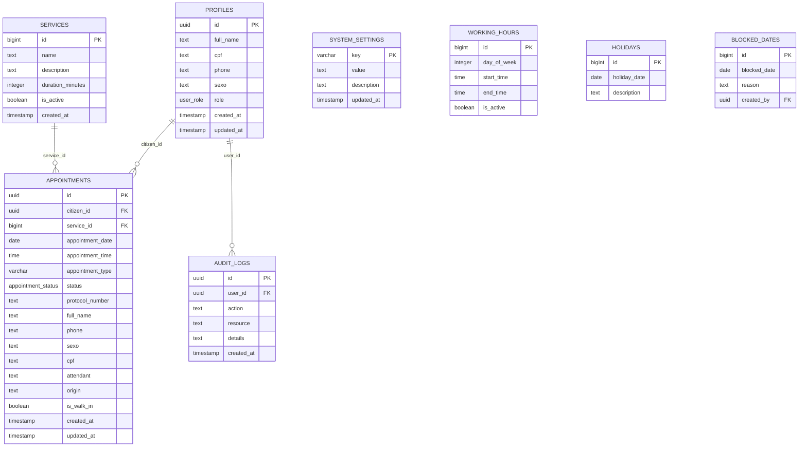

# Modelo de Dados — Painel de Identificação Civil

> Especificação completa do banco de dados relacional PostgreSQL (Supabase), incluindo dicionário de tabelas, enums, triggers, diagramas ER e histórico de migrations.

---

## 1. Diagrama de Entidade-Relacionamento (ERD)

---

## 2. Tipos Enumerados (Enums)

### 2.1. `user_role`
Define os níveis de permissão dos usuários autenticados no sistema:
- `'admin'`: Administrador geral e atendente do posto de identificação.
- `'citizen'`: Cidadão padrão cadastrado.
- `'manager'`: Gestor institucional (se aplicável).

### 2.2. `appointment_status`
Representa os estados possíveis no ciclo de vida de um agendamento:
- `'scheduled'`: Agendamento criado pelo cidadão ou atendente.
- `'confirmed'`: Confirmado pelo sistema (estado ativo padrão).
- `'no_show'`: Cidadão não compareceu no horário estipulado (marcado em vermelho).
- `'completed'`: Atendimento presencial finalizado com sucesso pelo atendente.
- `'cancelled'`: Atendimento cancelado (por ação do cidadão ou do atendente).

---

## 3. Dicionário de Tabelas

### 3.1. Tabela `profiles`
Armazena dados cadastrais complementares dos usuários atrelados ao `auth.users` do Supabase.

| Campo | Tipo | Nulo | Default | Descrição |
| :--- | :--- | :--- | :--- | :--- |
| `id` | `UUID` | NÃO | — | Chave primária, vinculada a `auth.users.id` (ON DELETE CASCADE) |
| `full_name` | `TEXT` | NÃO | — | Nome completo do usuário |
| `cpf` | `TEXT` | SIM | — | CPF formatado (`000.000.000-00`) |
| `phone` | `TEXT` | SIM | — | Telefone / WhatsApp de contato |
| `sexo` | `TEXT` | SIM | `'Não informado'` | Opções: `'Masculino'`, `'Feminino'`, `'Outro'`, `'Não informado'` |
| `role` | `user_role` | NÃO | `'citizen'` | Papel de acesso no sistema |
| `created_at` | `TIMESTAMPTZ` | NÃO | `NOW()` | Data/hora de cadastro |
| `updated_at` | `TIMESTAMPTZ` | NÃO | `NOW()` | Data/hora da última atualização |

---

### 3.2. Tabela `services`
Catálogo de serviços oferecidos pelo posto de identificação civil.

| Campo | Tipo | Nulo | Default | Descrição |
| :--- | :--- | :--- | :--- | :--- |
| `id` | `BIGINT` (IDENTITY) | NÃO | — | Identificador único numérico (PK) |
| `name` | `TEXT` | NÃO | — | Nome do serviço (ex.: `'Emissão de RG'`) |
| `description` | `TEXT` | SIM | — | Descrição detalhada do serviço |
| `duration_minutes` | `INTEGER` | NÃO | `30` | Duração de cada atendimento em minutos |
| `is_active` | `BOOLEAN` | NÃO | `true` | Se o serviço está ativo para novos agendamentos |
| `created_at` | `TIMESTAMPTZ` | NÃO | `NOW()` | Data/hora de criação |

---

### 3.3. Tabela `appointments`
Tabela central de agendamentos de atendimentos presenciais e online.

| Campo | Tipo | Nulo | Default | Descrição |
| :--- | :--- | :--- | :--- | :--- |
| `id` | `UUID` | NÃO | `gen_random_uuid()` | Chave primária do agendamento (PK) |
| `citizen_id` | `UUID` | SIM | — | FK para `profiles.id` (nulo em agendamento anônimo/balcão) |
| `service_id` | `BIGINT` | NÃO | — | FK para `services.id` |
| `appointment_date`| `DATE` | NÃO | — | Data do agendamento (`YYYY-MM-DD`) |
| `appointment_time`| `TIME` | NÃO | — | Horário de início do atendimento (`HH:MM:SS`) |
| `appointment_type`| `VARCHAR(50)` | NÃO | `'first_issue'` | Tipo de via: `'first_issue'` (1ª Via) ou `'second_issue'` (2ª Via) |
| `status` | `appointment_status`| NÃO | `'confirmed'` | Status do agendamento |
| `protocol_number` | `TEXT` | NÃO | — | Protocolo único gerado (ex.: `'20260916-893O65'`) |
| `full_name` | `TEXT` | SIM | — | Nome do titular do agendamento |
| `phone` | `TEXT` | SIM | — | Telefone de contato do titular |
| `sexo` | `TEXT` | SIM | `'Não informado'` | Sexo do titular (`'Masculino'`, `'Feminino'`, etc.) |
| `cpf` | `TEXT` | SIM | — | CPF do titular (quando fornecido) |
| `attendant` | `TEXT` | SIM | — | Identificação do Guichê (ex.: `'Guichê 01 - Dra. Lima'`) |
| `origin` | `TEXT` | SIM | `'online'` | Canal de origem: `'online'` ou `'presencial'` |
| `is_walk_in` | `BOOLEAN` | SIM | `false` | Se foi agendamento presencial imediato |
| `created_at` | `TIMESTAMPTZ` | NÃO | `NOW()` | Data/hora da criação |
| `updated_at` | `TIMESTAMPTZ` | NÃO | `NOW()` | Data/hora da última alteração de status |

---

### 3.4. Tabela `system_settings`
Configurações globais parametrizáveis da aplicação.

| Campo | Tipo | Nulo | Default | Descrição |
| :--- | :--- | :--- | :--- | :--- |
| `key` | `VARCHAR(100)` | NÃO | — | Chave única de configuração (PK) |
| `value` | `TEXT` | NÃO | — | Valor da configuração (ex.: `'200'`) |
| `description` | `TEXT` | SIM | — | Descrição da finalidade da configuração |
| `updated_at` | `TIMESTAMPTZ` | NÃO | `NOW()` | Data/hora da última alteração |

**Chaves Padrão Cadastradas:**
- `monthly_limit`: Limite mensal de agendamentos do posto (padrão: `200`).
- `second_issue_warning`: Texto institucional exibido para solicitantes de 2ª via (guia DAE).

---

### 3.5. Tabela `working_hours`
Grade de funcionamento semanal do posto.

| Campo | Tipo | Nulo | Default | Descrição |
| :--- | :--- | :--- | :--- | :--- |
| `id` | `BIGINT` (IDENTITY) | NÃO | — | Chave primária (PK) |
| `day_of_week` | `INTEGER` | NÃO | — | Dia da semana (1 = Segunda, 2 = Terça ... 5 = Sexta) |
| `start_time` | `TIME` | NÃO | — | Horário de início do turno (ex.: `'08:00:00'`, `'13:30:00'`) |
| `end_time` | `TIME` | NÃO | — | Horário de término do turno (ex.: `'12:30:00'`, `'17:00:00'`) |
| `is_active` | `BOOLEAN` | NÃO | `true` | Se o turno está ativo |

---

### 3.6. Tabela `audit_logs`
Trilha de auditoria para conformidade, segurança e rastreabilidade.

| Campo | Tipo | Nulo | Default | Descrição |
| :--- | :--- | :--- | :--- | :--- |
| `id` | `UUID` | NÃO | `gen_random_uuid()` | Chave primária (PK) |
| `user_id` | `UUID` | SIM | — | FK para `profiles.id` do operador |
| `action` | `TEXT` | NÃO | — | Nome da ação (ex.: `'UPDATE_APPOINTMENT_STATUS'`) |
| `resource` | `TEXT` | NÃO | — | Tabela ou módulo afetado (ex.: `'appointments'`) |
| `details` | `TEXT` | SIM | — | Descrição textual da alteração realizada |
| `created_at` | `TIMESTAMPTZ` | NÃO | `NOW()` | Data/hora do evento |

---

## 4. Histórico de Migrations (`supabase/migrations/`)

| Data / Versão | Arquivo SQL | Resumo das Alterações |
| :--- | :--- | :--- |
| `2026-09-15 23:55` | `20260915235500_initial_schema.sql` | Criação dos tipos enum, tabelas principais (`profiles`, `services`, `appointments`, `system_settings`, `audit_logs`, `holidays`, `blocked_dates`, `working_hours`) e políticas de RLS. |
| `2026-09-15 23:58` | `20260915235800_auth_triggers.sql` | Criação da função e trigger `on_auth_user_created` para sincronizar novos usuários do Supabase Auth com a tabela `profiles`. |
| `2026-09-16 00:10` | `20260916001000_seed_institutional_data.sql` | Inserção do serviço inicial "Emissão de RG" e configurações de limite mensal (`monthly_limit = 200`). |
| `2026-09-16 00:20` | `20260916002000_seed_working_hours.sql` | Cadastro dos turnos de atendimento (Segunda a Sexta, manhã 08:00–12:30 e tarde 13:30–17:00). |
| `2026-09-16 00:30` | `20260916003000_booking_engine.sql` | Stored Procedure transacional `book_appointment` com geração de protocolo formatado e prevenção de concorrência de horário. |
| `2026-09-16 16:00` | `20260916160000_add_sexo_field.sql` | Adição da coluna `sexo` nas tabelas `profiles` e `appointments` para atendimento aos requisitos cadastrais civis. |
