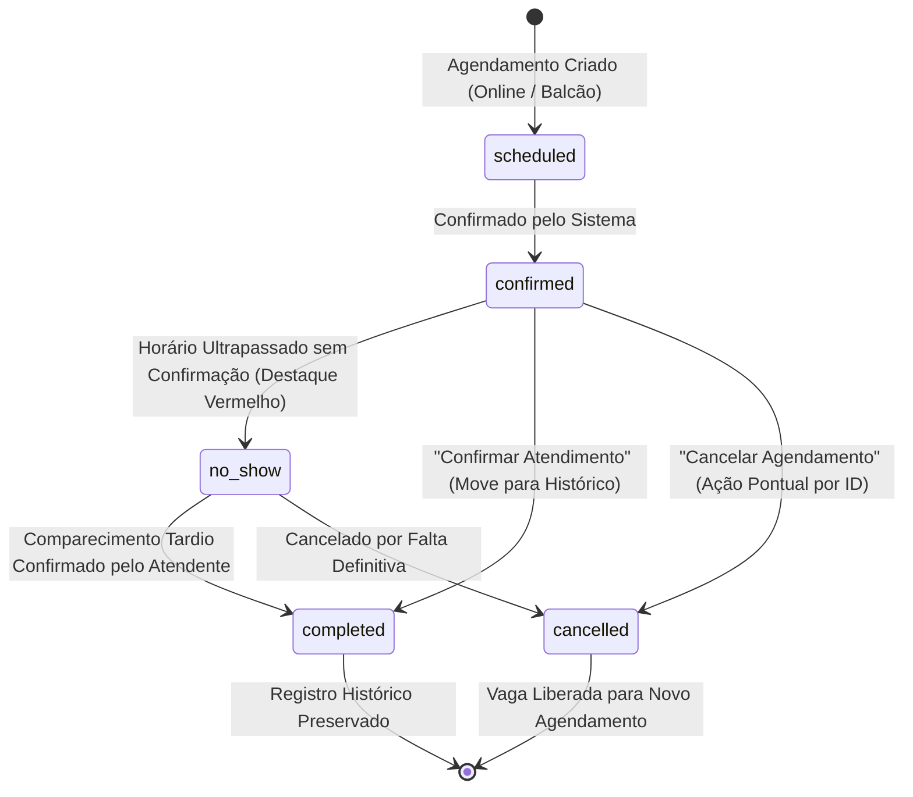
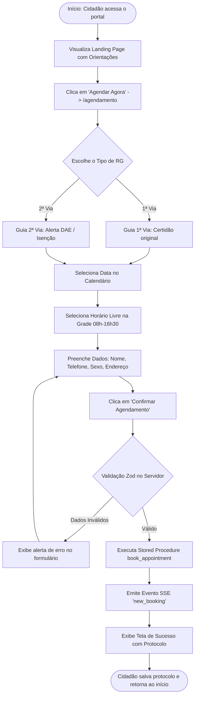
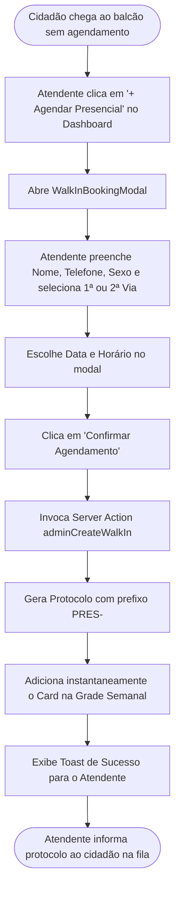
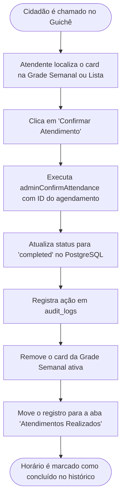
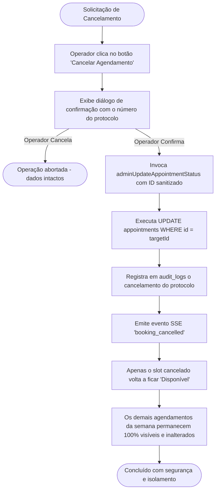

# Regras de Negócio & Fluxos Operacionais — Painel de Identificação Civil

> Especificação formal de todas as regras de negócio, limites operacionais, validações de campos, ciclo de vida de status e fluxogramas das jornadas de atendimento.

---

## 1. Ciclo de Vida do Agendamento e Transições de Status

### 1.1. Tabela de Transições de Status Permitidas

| Status Atual | Próximo Status Possível | Gatilho / Ação | Regra de Negócio |
| :--- | :--- | :--- | :--- |
| `scheduled` / `confirmed` | `completed` | Clique em **"Confirmar Atendimento"** | O cidadão compareceu e foi atendido. O card é removido da Grade Semanal e direcionado para a visualização de Atendimentos Realizados. |
| `scheduled` / `confirmed` | `no_show` (Atrasado) | **Automático** por comparação de horário (`isAppointmentOverdue`) | Se o horário do agendamento passou e o atendente não confirmou o atendimento, o sistema renderiza o card em **Vermelho** com badge `⏰ Atrasado`. |
| `no_show` | `completed` | Clique em **"Confirmar Atendimento"** | **Tolerância a Atrasos:** Cidadãos que chegarem atrasados no mesmo dia podem ser atendidos normalmente sem recadastro. |
| Qualquer (exceto `completed`) | `cancelled` | Clique em **"Cancelar Agendamento"** | Cancela exclusivamente o registro com o ID selecionado. A vaga no horário volta a ficar livre para agendamentos. |

---

## 2. Regras Operacionais e de Negócio

### 2.1. Regras de Horários e Faixas de Atendimento
- **Turnos de Atendimento:** Segunda a Sexta-feira:
  - **Manhã:** 08:00 às 12:30 (slots a cada 30 minutos: `08:00`, `08:30`, `09:00`, `09:30`, `10:00`, `10:30`, `11:00`, `11:30`, `12:00`).
  - **Tarde:** 13:30 às 17:00 (slots a cada 30 minutos: `13:30`, `14:00`, `14:30`, `15:00`, `15:30`, `16:00`, `16:30`).
- **Duração do Serviço:** Fixada em **30 minutos** por padrão para Emissão de RG.
- **Bloqueio de Dias:** Finais de semana (Sábado e Domingo) e datas registradas na tabela `holidays` / `blocked_dates` são bloqueadas automaticamente para agendamentos.

### 2.2. Regra de Limite Mensal do Posto (`monthly_limit`)
- O posto municipal possui um limite de capacidade mensal configurável em `system_settings` (padrão: **200 agendamentos/mês**).
- O Painel exibe em tempo real o cálculo: `Vagas Restantes = max(0, limite - agendamentos_do_mes)`.

### 2.3. Regras de Guichês e Atribuição de Atendentes
- **1ª Via de RG:** Atribuída por padrão ao **Guichê 01 - Dra. Lima** (Serviço gratuito, conferência de certidão).
- **2ª Via de RG:** Atribuída por padrão ao **Guichê 02 - Dr. Silva** (Exige conferência da taxa DAE paga ou comprovante de isenção).

### 2.4. Comparativo: Fluxo Online (Cidadão) vs. Fluxo Presencial (Balcão)

| Regra / Validação | Agendamento Online (Cidadão) | Agendamento Presencial (Balcão) |
| :--- | :--- | :--- |
| **Autenticação Prévia** | NÃO requer login ou criação de conta | Requer operador autenticado (`admin`) |
| **Campo CPF** | Opcional (não bloqueia o cidadão) | Opcional (atende cidadãos sem documento em mãos) |
| **Campo Sexo** | **Obrigatório** (`Masculino`, `Feminino`, `Outro`) | **Obrigatório** (`Masculino`, `Feminino`, `Outro`) |
| **Prefixo do Protocolo** | `YYYYMMDD-XXXXXX` (ex.: `20260916-893O65`) | `PRES-YYYYMMDD-XXXX` (ex.: `PRES-20260916-A1B2`) |
| **Origem do Dado** | Marcado como `origin: 'online'`, `is_walk_in: false` | Marcado como `origin: 'presencial'`, `is_walk_in: true` |

---

## 3. Fluxogramas das Jornadas Principais

### 3.1. Jornada 1: Cidadão Realiza Agendamento Online

---

### 3.2. Jornada 2: Atendente Realiza Agendamento Presencial (Balcão)

---

### 3.3. Jornada 3: Atendente Confirma Atendimento Realizado

---

### 3.4. Jornada 4: Cancelamento Isolado de Agendamento (Proteção P0)

